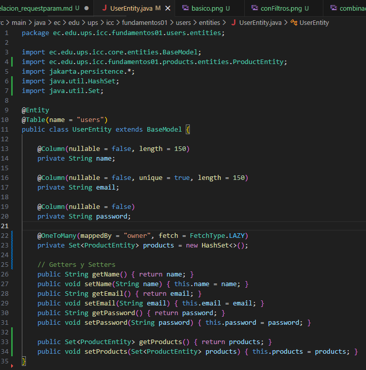
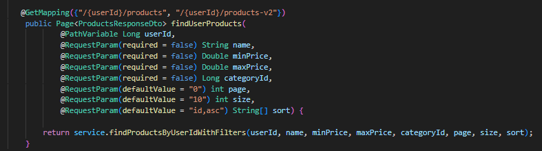
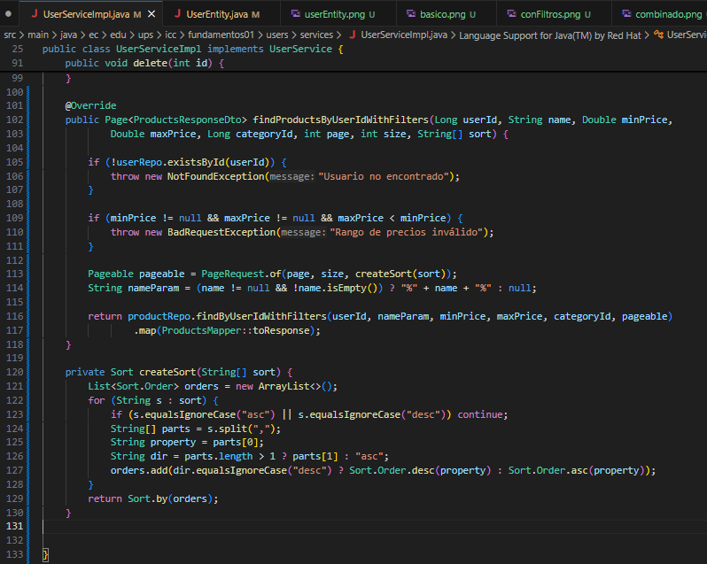
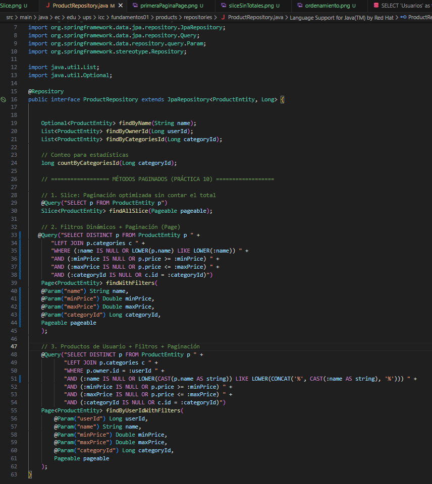
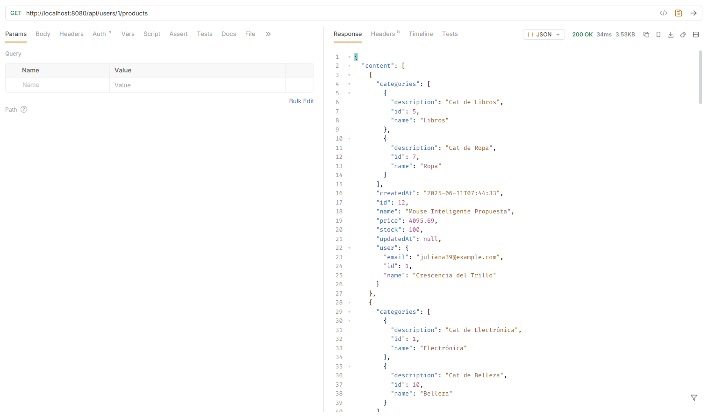
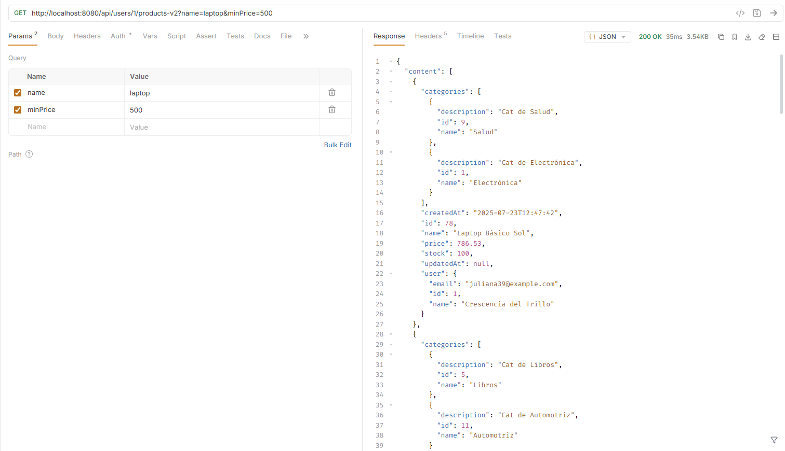
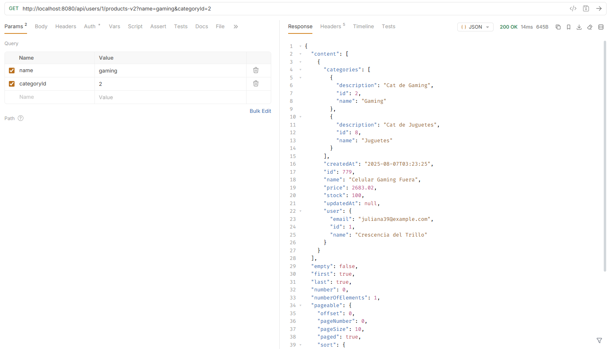
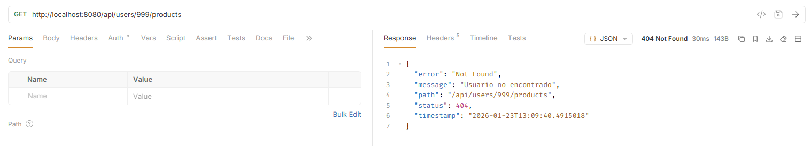
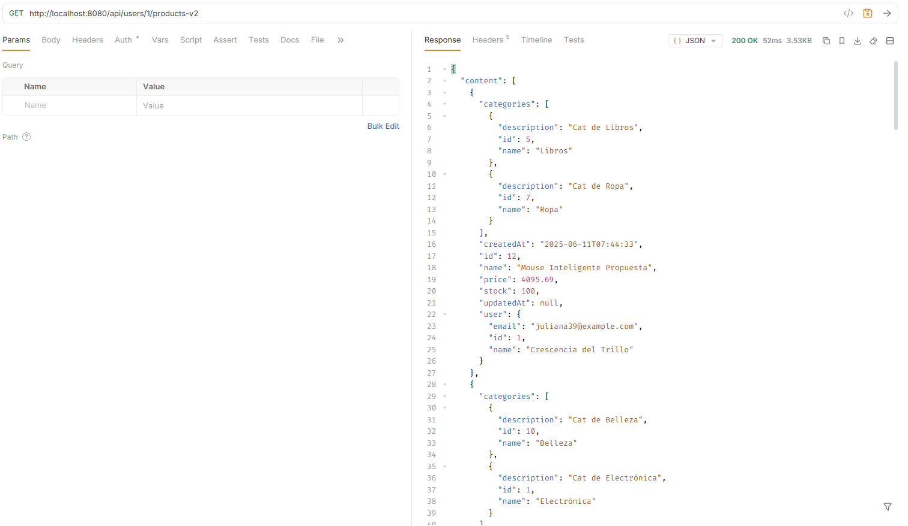
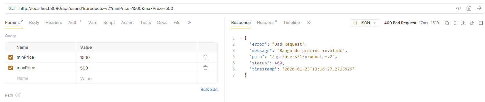

# Programación y Plataformas Web

# **Spring Boot – Request Parameters en Consultas Relacionadas: Contexto Semántico y Filtrado**

# **9. Resultados y Evidencias Requeridas**

## **9.1. Evidencias de implementación**

1. **Captura de UserEntity.java** con relación `@OneToMany` agregada

2. **Captura de UserController.java** con ambos endpoints implementados

3. **Captura de UserServiceImpl.java** con métodos de consulta relacionada

4. **Captura de ProductRepository.java** con consulta `@Query` personalizada

## **9.2. Evidencias de funcionamiento**

1. **Request básico**: `GET /api/users/1/products` con respuesta exitosa

2. **Request con filtros**: `GET /api/users/1/products-v2?name=laptop&minPrice=500` con productos filtrados

3. **Request combinado**: `GET /api/users/1/products-v2?name=gaming&categoryId=2` mostrando múltiples filtros

4. **Error handling**: `GET /api/users/999/products` mostrando error 404

## **9.3. Evidencias técnicas**

1. **SQL queries**: Logs mostrando SQL generado por la consulta con filtros

SELECT DISTINCT p.id, p.name, p.price, p.description, p.created_at, p.user_id 
FROM products p 
LEFT JOIN product_categories pc ON p.id = pc.product_id 
LEFT JOIN categories c ON pc.category_id = c.id 
WHERE p.user_id = ? 
  AND (COALESCE(?, '') = '' OR LOWER(p.name) LIKE LOWER(CONCAT('%', ?, '%'))) 
  AND (? IS NULL OR p.price >= ?) 
  AND (? IS NULL OR p.price <= ?) 
  AND (? IS NULL OR c.id = ?);

2. **Tests unitarios**: Capturas de tests pasando para ambos métodos del servicio

3. **Validation**: Captura de error 400 con filtros inválidos (ej: minPrice > maxPrice)

## **9.4. Datos para revisión**

**Usar los productos creados en el tema anterior**:
- Usuario 1 con productos: "Laptop Gaming", "Mouse Inalámbrico", "Monitor 4K"
- Usuario 2 con productos: "Teclado Mecánico", "Libro Java"
- Categorías: "Electrónicos", "Gaming", "Oficina", "Libros"

**Consultas de prueba**:
1. Todos los productos del usuario 1
2. Productos del usuario 1 que contengan "gaming"
3. Productos del usuario 1 entre $500 y $1500
4. Productos del usuario 1 de categoría "Electrónicos"
5. Combinación: productos "gaming" + precio > $800 + categoría "Gaming"

# **10. Conclusiones**

Esta implementación demuestra:

* **Contexto semántico correcto**: `/users/{id}/products` refleja la relación del dominio
* **Separación de responsabilidades**: UserController → UserService → ProductRepository
* **Consultas explícitas**: Uso directo de `productRepository.findByOwnerId()` 
* **Filtrado eficiente**: Request parameters aplicados en base de datos
* **Escalabilidad**: Solución que funciona con grandes volúmenes de datos
* **Mantenibilidad**: Código claro, testeable y extensible

