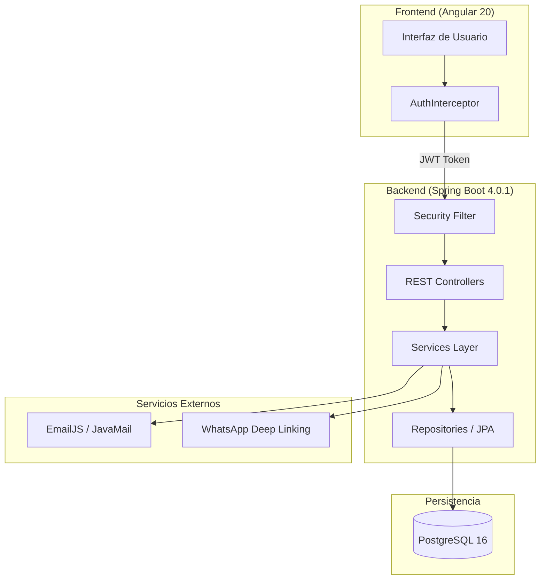

# Universidad Politécnica Salesiana


---

# 🚀 DOCUMENTACIÓN TÉCNICA: SISTEMA "LEMIBIT" V2.0
## Gestión Integral de Portafolios y Asesorías Técnicas con Arquitectura Distribuida

<div align="center">


**Autor:** Leo Vásconez • **Carrera:** Ingeniería en Ciencias de la Computación
**Sede:** Cuenca, Ecuador • **Materia:** Programación Web
**Periodo Lectivo:** Octubre - Febrero 2026

</div>

---

## 📖 1. Resumen del Proyecto

**LeMiBit** es una aplicación web de arquitectura distribuida diseñada para la gestión de portafolios multiusuario. El sistema permite centralizar proyectos técnicos y gestionar solicitudes de asesoría entre programadores y usuarios externos. La versión 2.0 consolida el uso de un **Backend en Spring Boot** y persistencia en **PostgreSQL**, cumpliendo con los estándares de seguridad JWT exigidos por la cátedra.

---

## 🏗️ 2. Arquitectura del Sistema

El sistema implementa una **Arquitectura en Capas (Layered Architecture)** para separar la presentación, la lógica de negocio y la persistencia de datos.

### 2.1 Diagrama de Flujo de Datos




### 2.2 Mapa del Repositorio (Estructura de Carpetas)

```text
LeMiBit-V2/
├── backend-spring/                 # Motor de la aplicación (Java 21)
│   ├── src/main/java/ec/edu/ups/icc/
│   │   ├── auth/                   # Gestión de JWT y autenticación
│   │   ├── config/                 # SecurityConfig, CORS y Swagger
│   │   ├── advisory/               # Módulo de asesorías y estados
│   │   ├── projects/               # CRUD de portafolios y proyectos
│   │   ├── users/                  # Manejo de roles y perfiles
│   │   └── utils/                  # Excepciones globales y EmailService
│   └── build.gradle.kts            # Dependencias con Kotlin DSL
├── frontend-angular/               # Interfaz reactiva (Angular 20)
│   ├── src/app/core/               # Interceptors, Guards y Servicios base
│   ├── src/app/modules/            # Módulos por rol: Admin, Programmer, Auth
│   ├── src/app/shared/             # Componentes comunes (Navbar, Footer)
│   └── tailwind.config.js          # Estilos atómicos con DaisyUI
└── docker-compose.yml              # Orquestación de base de datos local
```

---

## 🛠️ 3. Especificaciones del Stack Tecnológico

* **Backend:** Java 21 LTS con Spring Boot 3.4. Implementación de **Spring Security** con política Stateless mediante JWT[cite: 30].
* **Frontend:** Angular 20 SPA utilizando **Signals** para una reactividad optimizada.
* **Base de Datos:** PostgreSQL 16 para garantizar la integridad relacional mediante llaves foráneas[cite: 28].
* **Documentación:** Integración de **SpringDoc OpenAPI 2.8.5** (Swagger) para el testeo de endpoints[cite: 51].

---

## 📊 4. Funcionalidades y Lógica de Negocio

* **Gestión de Asesorías:** Registro de horarios de disponibilidad y gestión de solicitudes[cite: 37].
* **Dashboard Analítico:** Visualización de métricas de efectividad mediante gráficos (Aprobadas vs Rechazadas)[cite: 38].
* **Notificaciones Duales:** Envío de correos vía EmailJS y contacto directo por WhatsApp[cite: 40, 42].
* **Reportería Profesional:** Exportación de datos a formatos Excel (.xlsx) y PDF[cite: 47].

---

## 📡 5. Mapa de Endpoints (API REST)

| Módulo | Endpoint | Método | Descripción | Autenticación |
| :--- | :--- | :--- | :--- | :--- |
| **Auth** | `/api/auth/login` | POST | Valida credenciales y entrega JWT | Pública |
| **Auth** | `/api/auth/register` | POST | Registra nuevos usuarios | Pública |
| **Users** | `/api/users/profile` | GET | Recupera el perfil del usuario logueado | Requerida |
| **Users** | `/api/users/{id}/role` | PATCH | Cambia el rol de un usuario (Admin) | ROLE_ADMIN |
| **Advisory** | `/api/advisories` | POST | Crea una solicitud de asesoría | Requerida |
| **Advisory** | `/api/advisories/stats` | GET | Estadísticas para el dashboard | Requerida |

---

## 📓 6. Log de Desarrollo: Desafíos Técnicos

* **Migración Relacional:** Transición de Firebase a PostgreSQL con rediseño de esquema OneToMany[cite: 28].
* **Reflexión de Parámetros:** Resolución del error `IllegalArgumentException` mediante nombres explícitos en `@PathVariable`.
* **Conflicto de Swagger:** Corrección de `NoSuchMethodError` mediante la versión 2.8.5 de SpringDoc.
* **Persistencia Local:** Implementación de `AuthInterceptor` para mantener sesión tras recargar (`F5`).

---

## 📘 7. Guía de Usuario (Entregable Nro. 4)

### 7.1 Rol Administrador
1. **Acceso:** Iniciar sesión con credenciales administrativas.
2. **Dashboard Global:** Visualizar gráficos de rendimiento de asesorías de todos los programadores registrados.
3. **Gestión de Roles:** Acceder a la lista de usuarios y asignar el rol de 'Programador' a los usuarios nuevos para que puedan gestionar portafolios.

### 7.2 Rol Programador
1. **Perfil y Portafolio:** Configurar descripción profesional, habilidades técnicas y enlaces sociales.
2. **Proyectos:** Agregar proyectos indicando título, URL de repositorio, rol (Frontend/Backend) y categoría.
3. **Asesorías:**
   * Establecer días y horarios de disponibilidad.
   * Revisar solicitudes pendientes en el panel y proceder a **Aprobar** o **Rechazar**.
   * Contactar al cliente vía WhatsApp mediante el enlace dinámico generado.

### 7.3 Usuario Externo / Cliente
1. **Exploración:** Navegar por la página de inicio para buscar programadores por especialidad.
2. **Solicitud:** Seleccionar un programador y completar el formulario de asesoría con fecha, hora y nota técnica.
3. **Seguimiento:** Esperar la notificación por correo sobre el estado de la solicitud.

---

## ⚙️ 8. Configuración y Ejecución

### 8.1 Requisitos Previos
* Java JDK 21
* Node.js v20+
* PostgreSQL 16 activo en puerto 5432.

### 8.2 Pasos de Instalación

**Backend:**
```bash
cd backend-spring
./gradlew bootRun
```

**Frontend:**
```bash
cd frontend-angular
npm install
ng serve
```

---

<div align="center">

**© 2026 - Leo Vásconez - Universidad Politécnica Salesiana**
*Proyecto Integrador - Programación y Plataformas Web*
*Docente: Ing. Pablo Andres Torres Peña*

</div>